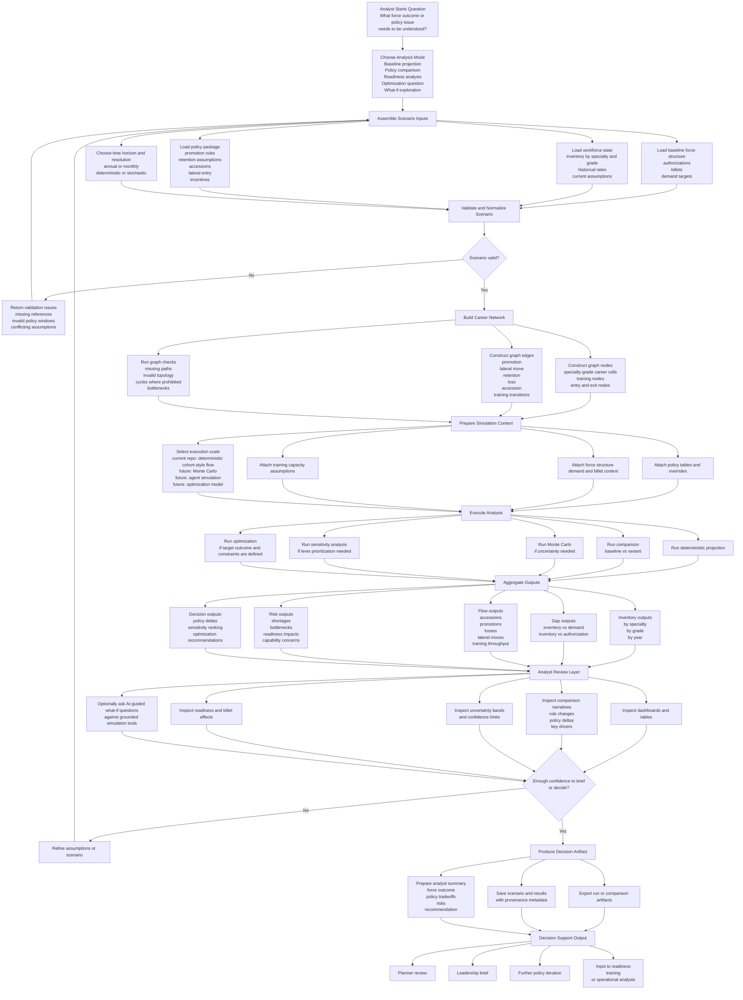

# Analyst Workflow Diagram

**Date:** 2026-03-26  
**Status:** Working analyst workflow view for MSim

## Purpose

This document visualizes the intended analyst workflow for MSim at a detailed but product-oriented level.

It reflects the larger platform direction described in the MSim vision while staying compatible with the current standalone app structure. It is a target-state workflow, not a claim that every branch is already implemented in this repo.

## Analyst Workflow

## Workflow Layers

### 1. Question Framing

The analyst begins with a force-management question, not a technical input format. MSim should support questions such as:

- what does the force look like in five years under current policy
- what happens if cyber accessions increase while end strength remains fixed
- where do shortages appear if retention falls in a target community
- what policy lever matters most for a readiness outcome

### 2. Scenario Assembly

This layer combines:

- inventory state
- force structure demand
- policy assumptions
- timeframe and execution mode

In the current app, this is still mostly a scenario payload plus local fixture loading. In the larger platform, it expands into richer data adapters and reusable scenario artifacts.

### 3. Network and Simulation Preparation

The central modeling move is to build a career-flow network and attach policy and demand context to it. This is where generic simulation mechanics and service-specific policy begin to separate.

### 4. Execution

Different analyst questions should route to different execution modes:

- deterministic projection for baseline force outlook
- comparison mode for policy deltas
- Monte Carlo for uncertainty
- sensitivity for lever ranking
- optimization for constrained planning problems

In this repo today, only deterministic projection and baseline-versus-variant comparison are implemented directly.

### 5. Review and Iteration

MSim should support an iterative loop rather than a one-shot run. The analyst reviews outputs, identifies weak assumptions or unacceptable risks, adjusts the scenario, and runs again.

### 6. Decision Artifacts

The end product is not only a chart. It is a reusable, auditable analytical artifact with:

- scenario definition
- provenance metadata
- result outputs
- comparison drivers
- optionally a recommendation or policy tradeoff summary

## Near-Term Mapping to the Current Repo

The current standalone app only implements a subset of this workflow:

- scenario assembly via inline payloads or named fixtures
- validation through Pydantic models
- career graph construction
- deterministic execution
- baseline-versus-variant comparison
- export and local record saving
- thin workbench for basic analyst interaction

Not yet implemented in this repo:

- force-structure and billet linkage
- training pipeline modeling
- Monte Carlo and sensitivity workflows
- optimization workflows
- AI-guided what-if exploration
- readiness and capability integration

## Suggested Next Visuals

Useful follow-on diagrams would be:

- career network structure diagram
- data architecture diagram
- simulation engine versus policy layer separation diagram
- readiness linkage diagram
- AI-assisted scenario exploration workflow

