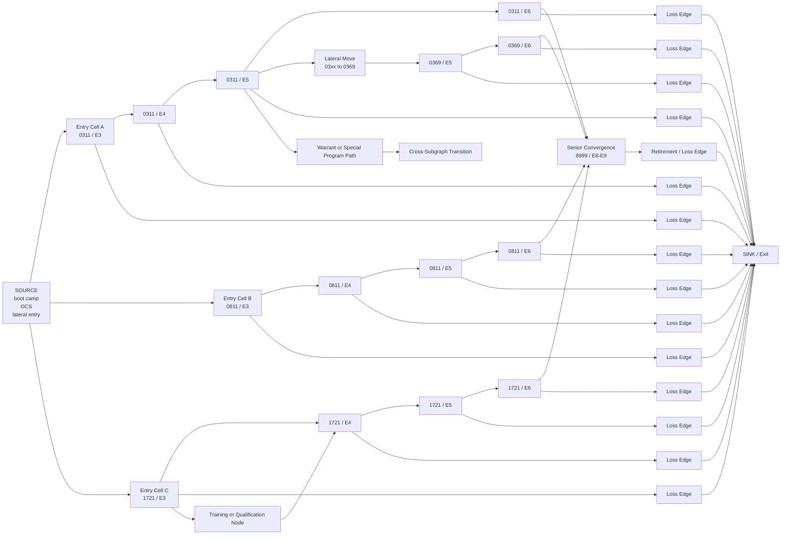

# Career Network Structure Diagram

**Date:** 2026-03-26  
**Status:** Working structure view for the MSim career-flow model

## Purpose

This diagram shows the intended shape of the manpower career network that underlies MSim.

It is not a full service-specific topology. It is a structural view of how entry, promotion, lateral movement, convergence, cross-subgraph transitions, and exit should connect in the model.

## Career Network Structure

## Interpretation

### Entry

A source node feeds multiple entry cells. In a full model, these would represent accession channels such as recruit training, commissioning, or lateral entry.

### Vertical Flow

Most career movement is upward through a specialty-specific promotion chain.

### Horizontal Flow

Some cells connect laterally into new specialties, reclassifications, or feeder MOS structures.

### Convergence

Some specialties converge into broader senior leader or staff pathways rather than remaining isolated forever.

### Exit

Every cell can have one or more loss edges leading to exit states. That includes early attrition, steady-state losses, and retirement.

### Optional Intermediate Nodes

Training, qualification, or screening nodes can sit between career cells where the policy model needs them.

### Cross-Subgraph Paths

The full architecture should allow transitions into other subgraphs such as warrant, officer, or special program pathways. This matters because the GamePlanOS MSim vision treats generalization as a topology problem, not an engine rewrite.

## Why This Diagram Matters

This is the structural heart of MSim:

- the graph topology is the service-specific model
- the simulation engine operates on this graph rather than hardcoded career ladders
- policy rules attach to nodes and edges rather than replacing the graph model
- generalization across services should come primarily from new graph topologies and policy sets

## Near-Term Mapping to the Current Repo

The current repo only implements a very small version of this idea:

- career cells
- transitions
- source and sink pseudo-nodes
- graph validation and deterministic flow application

Not yet implemented:

- force-wide topology
- training or qualification nodes
- officer and warrant subgraphs
- explicit convergence patterns at scale
- service-configurable graph loading

