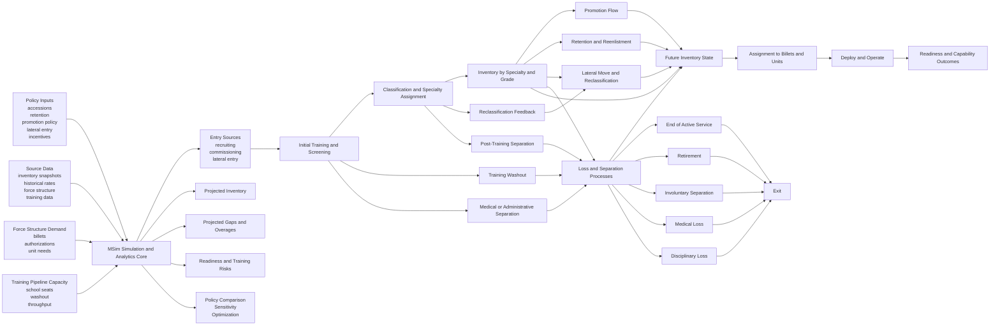

# Force Analytics Flow

**Date:** 2026-03-26  
**Status:** Working end-to-end force analytics view for MSim

## Purpose

This diagram shows the larger MSim force analytics loop from inputs and policy levers through personnel flow, billet assignment, and decision-support outputs.

It sits above the current deterministic MVP and below the broader platform vision. The intent is to show the force-management problem MSim is growing into, not just the mechanics currently implemented in this repo.

## Force Analytics Flow

## Interpretation

- MSim is not only a projection engine. It is the analytical core that connects policy inputs, source data, force demand, and training capacity into future force outcomes.
- Inventory is an intermediate state, not the final answer. The real value appears when projected inventory is mapped to billets, readiness, and capability effects.
- The same force flow should support deterministic projection, comparison, sensitivity analysis, and optimization rather than separate disconnected workflows.
- Training, losses, and reclassification are first-class parts of the force lifecycle, not side calculations.

## Near-Term Mapping to the Current Repo

The current standalone app implements only a subset of this flow:

- scenario inputs and policy tables
- deterministic projection
- baseline-versus-variant comparison
- export and local record saving

Not yet implemented in this repo:

- training pipeline modeling
- billet assignment and readiness linkage
- sensitivity analysis
- optimization workflows
- live or authoritative data adapters

