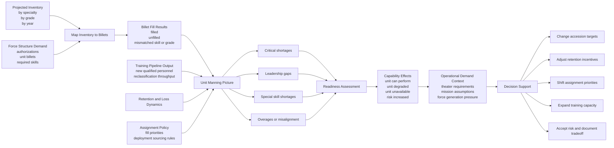

# Readiness Linkage Diagram

**Date:** 2026-03-26  
**Status:** Working readiness linkage view for MSim

## Purpose

This diagram shows how manpower projections should connect to billet fill, unit manning, readiness, and operational capability questions.

It is a Horizon 2 style view: beyond the current MVP, but directly connected to the roadmap and platform vision. The repo now has a small bridge toward this space: app-local readiness pressure signals plus grouped authorization/fill summaries for pack-backed scenarios, using explicit authorization counts when a pack provides them and falling back to demand only when it does not. The projection summary now also exposes which basis was used so the analyst-facing view stays honest. That is not billet fill yet, but it gives analysts an early view of where readiness pressure concentrates and which communities or force elements are underfilled.

## Readiness Linkage

## Interpretation

- inventory projection alone is not enough
- readiness emerges when projected people are mapped against actual demand
- shortages matter differently depending on billet criticality, unit type, and skill concentration
- training, assignment policy, retention, and losses all feed the readiness picture
- the value of MSim increases materially when it can explain not just inventory gaps, but readiness consequences
- operational meaning sits downstream of billet fill and readiness, not parallel to them

