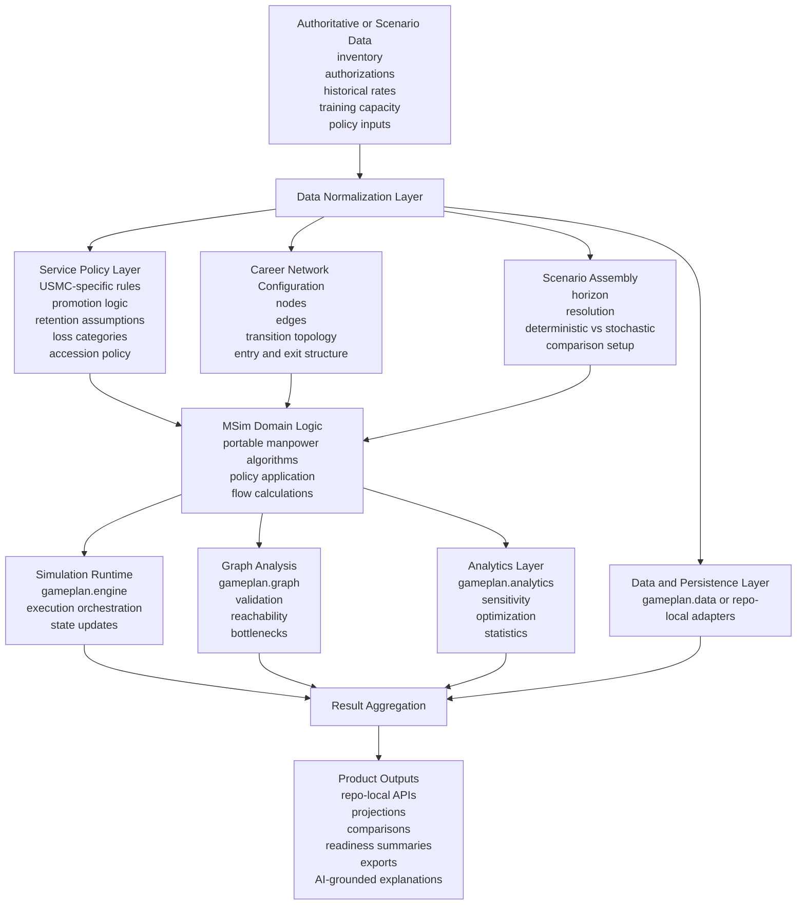

# Simulation Policy Data Separation Diagram

**Date:** 2026-03-26  
**Status:** Working architecture boundary view for MSim

## Purpose

This diagram shows the separation MSim should maintain between data inputs, service-specific policy, the career-network model, and the execution engine.

It is also the clearest package-boundary visual for this repo: use GamePlanOS packages for shared substrate concerns, keep manpower-specific domain logic portable, and keep app orchestration and product outputs local to MSim.

## Separation Diagram

## Interpretation

- Data should be normalized before it touches policy or simulation code.
- Service-specific behavior should live in policy and graph configuration, not in the engine.
- The career graph expresses structural pathways.
- The domain logic applies policy to those pathways.
- `gameplan.engine`, `gameplan.graph`, and `gameplan.analytics` should remain reusable substrate concerns rather than becoming app-specific logic hosts.
- Persistence is a separate adapter boundary, whether this repo remains file-backed for now or later migrates toward `gameplan.data`.
- Product outputs should depend on stable internal boundaries rather than direct coupling to raw data shapes.

